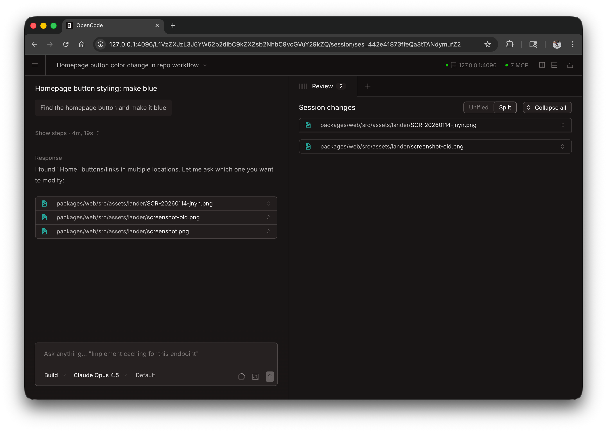

WebForge สามารถทำงานเป็นเว็บแอปพลิเคชันในเบราว์เซอร์ของคุณได้ โดยมอบประสบการณ์การเขียนโค้ด AI อันทรงพลังแบบเดียวกันโดยไม่ต้องใช้ terminal


## เริ่มต้นใช้งาน

เริ่มเว็บอินเตอร์เฟสด้วยการรัน:

```bash
webforge web
```

สิ่งนี้จะเริ่มต้นเซิร์ฟเวอร์ท้องถิ่นบน `127.0.0.1` ด้วยพอร์ตที่มีอยู่แบบสุ่มและเปิด WebForge โดยอัตโนมัติในเบราว์เซอร์เริ่มต้นของคุณ

:::caution
หากไม่ได้ตั้งค่า `WEBFORGE_SERVER_PASSWORD` เซิร์ฟเวอร์จะไม่ปลอดภัย นี่เป็นเรื่องปกติสำหรับการใช้งานภายในเครื่อง แต่ควรตั้งค่าสำหรับการเข้าถึงเครือข่าย
:::

:::tip[ผู้ใช้ Windows]
เพื่อประสบการณ์ที่ดีที่สุด ให้เรียกใช้ `webforge web` จาก [WSL](/docs/windows-wsl) แทนที่จะเป็น PowerShell สิ่งนี้ทำให้มั่นใจได้ถึงการเข้าถึงระบบไฟล์ที่เหมาะสมและการรวม terminal
:::

---

## การกำหนดค่า

คุณสามารถกำหนดค่าเว็บเซิร์ฟเวอร์ได้โดยใช้แฟล็กบรรทัดคำสั่งหรือใน [ไฟล์กำหนดค่า](/docs/config)

### พอร์ต

ตามค่าเริ่มต้น WebForge จะเลือกพอร์ตที่พร้อมใช้งาน คุณสามารถระบุพอร์ต:

```bash
webforge web --port 4096
```

### ชื่อโฮสต์

ตามค่าเริ่มต้น เซิร์ฟเวอร์จะเชื่อมโยงกับ `127.0.0.1` (เฉพาะโลคัลโฮสต์เท่านั้น) หากต้องการให้ WebForge เข้าถึงได้บนเครือข่ายของคุณ:

```bash
webforge web --hostname 0.0.0.0
```

เมื่อใช้ `0.0.0.0` WebForge จะแสดงทั้งที่อยู่ในท้องถิ่นและเครือข่าย:

```
  Local access:       http://localhost:4096
  Network access:     http://192.168.1.100:4096
```

### การค้นพบ mDNS

เปิดใช้งาน mDNS เพื่อให้เซิร์ฟเวอร์ของคุณค้นพบได้บนเครือข่ายท้องถิ่น:

```bash
webforge web --mdns
```

สิ่งนี้จะตั้งชื่อโฮสต์เป็น `0.0.0.0` โดยอัตโนมัติและโฆษณาเซิร์ฟเวอร์เป็น `webforge.local`

คุณสามารถปรับแต่งชื่อโดเมน mDNS เพื่อเรียกใช้หลายอินสแตนซ์บนเครือข่ายเดียวกันได้:

```bash
webforge web --mdns --mdns-domain myproject.local
```

### CORS

หากต้องการอนุญาตโดเมนเพิ่มเติมสำหรับ CORS (มีประโยชน์สำหรับส่วนหน้าที่กำหนดเอง):

```bash
webforge web --cors https://example.com
```

### การรับรองความถูกต้อง

เพื่อป้องกันการเข้าถึง ให้ตั้งรหัสผ่านโดยใช้ตัวแปรสภาพแวดล้อม `WEBFORGE_SERVER_PASSWORD`:

```bash
WEBFORGE_SERVER_PASSWORD=secret webforge web
```

ชื่อผู้ใช้มีค่าเริ่มต้นเป็น `webforge` แต่สามารถเปลี่ยนได้ด้วย `WEBFORGE_SERVER_USERNAME`

---

## การใช้เว็บอินเตอร์เฟส

เมื่อเริ่มต้นแล้ว เว็บอินเตอร์เฟสจะให้สิทธิ์การเข้าถึงเซสชัน WebForge ของคุณ

### เซสชัน

ดูและจัดการเซสชันของคุณจากหน้าแรก คุณสามารถดูเซสชันที่ใช้งานอยู่และเริ่มต้นเซสชันใหม่ได้



### สถานะเซิร์ฟเวอร์

คลิก "ดูเซิร์ฟเวอร์" เพื่อดูเซิร์ฟเวอร์ที่เชื่อมต่อและสถานะ


---

## การต่อ terminal

คุณสามารถแนบ terminal TUI กับเว็บเซิร์ฟเวอร์ที่ทำงานอยู่:

```bash
# Start the web server
webforge web --port 4096

# In another terminal, attach the TUI
webforge attach http://localhost:4096
```

ซึ่งจะทำให้คุณสามารถใช้ทั้งเว็บอินเทอร์เฟซและ terminal พร้อมกัน โดยแชร์เซสชันและสถานะเดียวกัน

---

## ไฟล์กำหนดค่า

คุณยังสามารถกำหนดการตั้งค่าเซิร์ฟเวอร์ในไฟล์กำหนดค่า `webforge.json` ของคุณได้:

```json
{
  "server": {
    "port": 4096,
    "hostname": "0.0.0.0",
    "mdns": true,
    "cors": ["https://example.com"]
  }
}
```

ธงบรรทัดคำสั่งมีความสำคัญเหนือกว่าการตั้งค่าไฟล์กำหนดค่า
